# M3xA Souls v3 — Layered Composition Architecture

Modular, classifier-routed soul system for M3xA response agents (Haiku 4.5 via Bedrock).
Replaces monolithic `soul_global.md` / `soul_brazil.md` (~5K tokens, 60+ directives) with
position-aware layered assembly targeting ≤2.6K instruction tokens worst case.

## Why v3
- Instruction compliance decays ~exponentially with directive count ("curse of instructions").
- Reasoning degrades past ~3K input tokens; Haiku needs minimal high-signal context.
- Rules in the middle of long prompts get lost (primacy/recency); v3 places hard rules
  first and output format last, adjacent to generation.
- Few canonical examples replace rule laundry-lists (Anthropic context-engineering guidance).

## Architecture

```mermaid
%%{init: {'theme': 'default', 'themeVariables': {'fontSize': '22px', 'fontFamily': 'Inter, system-ui, -apple-system, sans-serif'}, 'flowchart': {'htmlLabels': true, 'curve': 'basis', 'nodeSpacing': 55, 'rankSpacing': 90, 'padding': 20}}}%%
flowchart TB
    subgraph RUNTIME["<b>⚡ Runtime — per query (Gateway)</b>"]
        direction TB
        U(["<b>👤 User query</b><br/><b>Telegram / Web</b>"]) --> CLS["<b>soul_classifier</b><br/><b>emits locale + tags</b><br/>iran · brazilbrief<br/>polymarket_data · price_action"]
        CLS --> RTR["<b>router.py</b><br/><b>tags → modules</b><br/>priority: geo &gt; brief &gt; pm &gt; charts<br/><b>max 2 modules</b>"]
        RTR --> ASM["<b>assembler.py</b><br/><b>position-aware concatenation</b><br/>+ token report"]
        ENT["<b>entity_*.md cards</b><br/><b>JIT injection</b> — only sources<br/>present in retrieved data"] --> FEED
        FEED[("<b>FeedCache / LanceDB</b><br/><b>118K+ rows</b><br/>AGENT + DATA CONTEXT")] --> ASM
        ASM --> HAIKU["<b>🧠 Claude Haiku 4.5</b><br/><b>via Bedrock</b>"]
        HAIKU --> TG(["<b>📱 Telegram response</b>"])
    end

    subgraph ORDER["<b>🧩 Assembly order — worst case 1,886 tok measured (budget 2,600)</b>"]
        direction TB
        C1["<b>1. {product}/souls/core.md</b><br/><b>712 tok</b><br/>identity · grounding · time · citation"]
        C2["<b>2. m3xa overlay 376 tok</b><br/><b>m3xabr overlay 344 tok</b><br/>source tiers · Brazil hard filter<br/>identity rules"]
        C3["<b>3. conditional modules — max 2</b><br/>geo 302 · polymarket 139<br/>charts 112 (brazilbrief disabled)"]
        C4["<b>4. {product}/souls/examples.md</b><br/><b>196 tok</b><br/>3 canonical few-shots"]
        C5["<b>5. AGENT_AND_DATA_CONTEXT</b><br/>placeholder<br/>Gateway inserts live feed here"]
        C6["<b>6. m3xa output 161 tok</b><br/><b>m3xabr output 142 tok</b><br/><b>format rules LAST</b> — recency effect"]
        C1 --> C2 --> C3 --> C4 --> C5 --> C6
    end
    ASM -. <b>builds</b> .-> C1

    subgraph CI["<b>🔁 Build · eval · governance</b>"]
        direction TB
        GH["<b>GitHub</b><br/>prcodex/version3-"] --> ACT["<b>GitHub Actions CI</b>"]
        ACT --> VAL["<b>validate.py</b><br/>budgets · duplicate rules<br/>forbidden patterns"]
        ACT --> TST["<b>pytest</b><br/>9 tests"]
        ACT --> CMP["<b>compiler.py → dist/</b><br/>soul_global_compiled ~2.0K tok<br/>soul_brazil_compiled ~2.2K tok"]
        CMP --> DEP["<b>deploy</b><br/>sync dist/ → House store<br/>bridge mode until Gateway<br/>assembles natively"]
        RC["<b>rubric-collector</b><br/>auto-detections"] --> CAND["<b>corrections/candidates.jsonl</b><br/>status: candidate<br/><b>NEVER touches a live soul</b>"]
        CAND -- "<b>human PROMOTE</b><br/>→ positive rule" --> MODS["<b>owning module</b><br/>in souls/"]
        CAND -- "<b>REJECT</b>" --> HIST["<b>corrections/history.jsonl</b>"]
        EVQ["<b>eval/queries.yaml</b><br/>12 pinned queries"] --> EVR["<b>run_eval.py — OLD vs NEW</b><br/>scored with evaluator_rubric.md"]
        EVR -- "<b>cutover:</b><br/>NEW ≥ OLD everywhere" --> DEP
    end
    DEP -. <b>loaded by</b> .-> ASM
    MODS -. <b>re-validate + recompile</b> .-> ACT

    C6 ~~~ GH

    click C1 "https://github.com/prcodex/version3-/blob/main/m3xa/souls/core.md" _blank
    click C2 "https://github.com/prcodex/version3-/blob/main/m3xa/souls/overlay.md" _blank
    click C3 "https://github.com/prcodex/version3-/tree/main/m3xa/souls/modules" _blank
    click C4 "https://github.com/prcodex/version3-/blob/main/m3xa/souls/examples.md" _blank
    click C6 "https://github.com/prcodex/version3-/blob/main/m3xa/souls/output.md" _blank
    click RTR "https://github.com/prcodex/version3-/blob/main/src/m3xa_souls/router.py" _blank
    click ASM "https://github.com/prcodex/version3-/blob/main/src/m3xa_souls/assembler.py" _blank
    click VAL "https://github.com/prcodex/version3-/blob/main/src/m3xa_souls/validate.py" _blank
    click CMP "https://github.com/prcodex/version3-/blob/main/src/m3xa_souls/compiler.py" _blank
    click CAND "https://github.com/prcodex/version3-/blob/main/src/m3xa_souls/corrections.py" _blank
    click EVQ "https://github.com/prcodex/version3-/blob/main/eval/queries.yaml" _blank
    click EVR "https://github.com/prcodex/version3-/blob/main/eval/run_eval.py" _blank
    click GH "https://github.com/prcodex/version3-" _blank
    click ACT "https://github.com/prcodex/version3-/blob/main/.github/workflows/ci.yml" _blank

    style RUNTIME fill:#dbeafe,stroke:#1e40af,stroke-width:3px,color:#0f172a
    style ORDER fill:#dcfce7,stroke:#166534,stroke-width:3px,color:#0f172a
    style CI fill:#f3e8ff,stroke:#7e22ce,stroke-width:3px,color:#0f172a
    style HAIKU fill:#fed7aa,stroke:#c2410c,stroke-width:4px,color:#7c2d12
    style C5 fill:#f1f5f9,stroke:#94a3b8,stroke-width:2px,stroke-dasharray:6 4,color:#0f172a
    style FEED fill:#fef3c7,stroke:#b45309,stroke-width:2px,color:#0f172a
    style ENT fill:#fef3c7,stroke:#b45309,stroke-width:2px,color:#0f172a
    style CAND fill:#fee2e2,stroke:#b91c1c,stroke-width:2px,color:#0f172a
    style MODS fill:#dcfce7,stroke:#166534,stroke-width:2px,color:#0f172a
    style DEP fill:#ddd6fe,stroke:#6d28d9,stroke-width:2px,color:#0f172a
```



## Layout
Two self-contained products, routed UPFRONT by the Gateway — no shared locale switch:

```
m3xa/         Global macro agent (English)
  souls/      core.md · overlay.md · examples.md · output.md · modules/{geo,polymarket,charts}.md
  routing.yaml  tag→module map, model tiering, cache config, token budgets
m3xabr/       Brazil agent (PT-BR) — own core, own identity, own routing
  souls/      core.md · overlay.md · examples.md · output.md · modules/{polymarket,charts,brazilbrief*}.md
  routing.yaml  (*brazilbrief present but enabled: false — deprioritized)
schemas/      geo_response.schema.json — Bedrock structured-output grammar
src/          assembler (cache-aware bedrock_payload), router, renderer, compiler, validator, corrections
eval/         12-query old-vs-new harness scored against evaluator_rubric
tests/        pytest suite; CI enforces budgets and lint on every PR
```

## v3.1 upgrades
- **Two products**: `assemble("m3xa"|"m3xabr", tags)` — fully isolated soul stacks.
- **Prompt caching (Bedrock, 1h TTL)**: `bedrock_payload()` returns system blocks with
  `cache_control` on the static prefix; data context always rides in the user message.
  Compiled monoliths are byte-identical per product => fully cacheable (~0.1x reads).
- **Structured outputs**: geo queries generate JSON under `schemas/geo_response.schema.json`
  via constrained decoding; `m3xa_souls.renderer.render_geo()` builds the Telegram HTML.
  Format compliance lives in code, not prompt rules.
- **Model tiering**: per-tag override in routing.yaml (e.g. `broad → claude-sonnet-4-6`).

## Quick start
```bash
pip install -e ".[dev]"
make validate          # lint all souls: budgets, forbidden patterns, duplicate rules
make compile           # materialize compiled souls for single-file gateways
pytest
python -m m3xa_souls.assembler --product m3xa --tags iran,polymarket_data --report
python -m m3xa_souls.assembler --product m3xa --tags iran --bedrock-json   # cache blocks + schema
```

## Gateway integration (two modes)
1. **Native**: Gateway calls `assemble(product, tags)` / `bedrock_payload(product, tags)` per query (preferred).
2. **Pre-compiled**: `compiler.py` materializes `dist/soul_m3xa_compiled.md` and
   `dist/soul_m3xabr_compiled.md` on every merge to main; Gateway keeps loading one file.
   (Bridge mode until Gateway supports multi-file assembly.)

## Corrections pipeline
Rubric-collector auto-detections land in `corrections/candidates.jsonl` — never in a live
soul. Promotion requires human approval and rewrites the lesson as a POSITIVE rule in the
owning module via `python -m m3xa_souls.corrections promote <id> --module modules/geo.md`.
