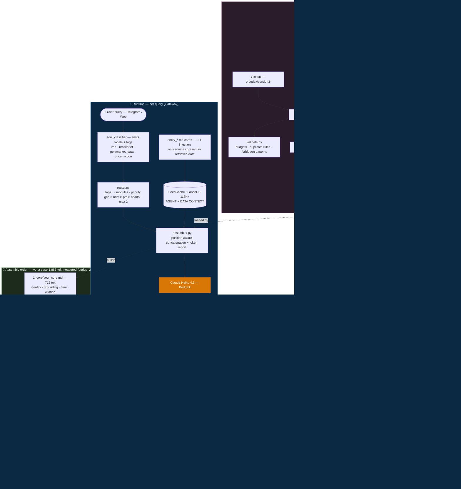

# M3xA Souls v3 — Layered Composition Architecture

Modular, classifier-routed soul system for M3xA response agents (Haiku 4.5 via Bedrock).
Replaces monolithic `soul_global.md` / `soul_brazil.md` (~5K tokens, 60+ directives) with
position-aware layered assembly targeting ≤2.6K instruction tokens worst case.

## Why v3
- Instruction compliance decays ~exponentially with directive count ("curse of instructions").
- Reasoning degrades past ~3K input tokens; Haiku needs minimal high-signal context.
- Rules in the middle of long prompts get lost (primacy/recency); v3 places hard rules
  first and output format last, adjacent to generation.
- Few canonical examples replace rule laundry-lists (Anthropic context-engineering guidance).

## Architecture



## Layout
```
souls/        Markdown modules (the actual prompt content)
  core/       Always loaded — identity, grounding, citation (~0.9K tok)
  overlays/   Locale layer: global | brazil (~0.5K tok)
  modules/    Conditional, classifier-routed: geo, polymarket, brazilbrief, charts
  output/     Format rules — always assembled LAST
  examples/   Canonical few-shot examples
routing/      routing.yaml — tag→module map, priorities, token budgets
src/          Python: assembler, router, compiler, validator, corrections pipeline
eval/         12-query old-vs-new harness scored against evaluator_rubric
tests/        pytest suite; CI enforces budgets and lint on every PR
```

## Quick start
```bash
pip install -e ".[dev]"
make validate          # lint all souls: budgets, forbidden patterns, duplicate rules
make compile           # materialize compiled souls for single-file gateways
pytest
python -m m3xa_souls.assembler --locale global --tags iran,price_action --report
```

## Gateway integration (two modes)
1. **Native**: Gateway calls `assemble(locale, tags)` per query (preferred).
2. **Pre-compiled**: `compiler.py` materializes `dist/soul_global_compiled.md` and
   `dist/soul_brazil_compiled.md` on every merge to main; Gateway keeps loading one file.
   (Bridge mode until Gateway supports multi-file assembly.)

## Corrections pipeline
Rubric-collector auto-detections land in `corrections/candidates.jsonl` — never in a live
soul. Promotion requires human approval and rewrites the lesson as a POSITIVE rule in the
owning module via `python -m m3xa_souls.corrections promote <id> --module modules/geo.md`.
